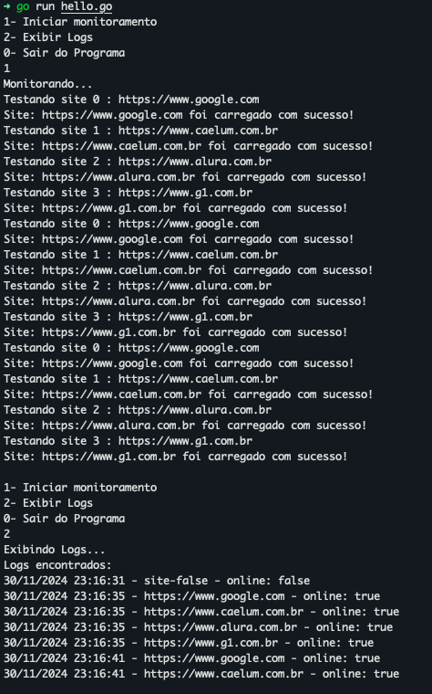

# Gopher monitoramento 

Projeto do meu primeiro curso de Go da Alura 


## Descrição 📝

Este é um projeto simples desenvolvido como parte do curso **"Go: A Linguagem do Google"** da Alura. No projeto, exploramos conceitos fundamentais da linguagem Go, como:

- Laços de repetição `for`
- Estrutura de controle `switch`
- Manipulação de arquivos (criação, gerenciamento e impressão)

O objetivo é proporcionar uma introdução prática e funcional à linguagem Go, utilizando exemplos que simulam um sistema básico de monitoramento.

## Funcionalidades ⚙️

- **Monitoramento de Sites:** O projeto realiza monitoramento de sites, verificando se estão online ou não.
- **Leitura e Registro de Logs:** O sistema pode ler arquivos de sites a serem monitorados e registrar logs com as respostas.
- **Exibição de Logs:** Permite exibir os logs de monitoramento gerados durante a execução do programa.

## Tecnologias Utilizadas 🛠️

- **Go:** Linguagem de programação utilizada no projeto. A linguagem Go é desenvolvida pelo Google e é conhecida pela sua simplicidade, velocidade e confiabilidade.
- **Git:** Sistema de controle de versão utilizado para gerenciar o código-fonte do projeto.
- **GitHub:** Plataforma para hospedagem do repositório e colaboração entre desenvolvedores.
- **VS Code:** Editor de código recomendado para desenvolvimento Go.

## Como Utilizar 

1. **Clone o repositório:**

   Caso você ainda não tenha o repositório no seu computador, clone-o com o comando:

   ```
   git clone https://github.com/kamillyceppas/go-alura-intro.git
   ```

2. **Entre no diretório do projeto:**

   Acesse o diretório onde o projeto foi clonado:

   ```
   cd go-alura-intro
    ```
3. **Execute o programa::**

   Utilize o Go para executar o programa diretamente:

   ```
   go run hello.go

    ```
   O programa irá iniciar e apresentar um menu interativo para que você possa escolher as opções desejadas, como monitorar sites ou visualizar logs.

## Exemplo de Execução 🖥️

Veja abaixo como o programa se comporta ao ser executado:




## Considerações Finais 🎯

Este projeto é uma introdução à linguagem Go, com foco no aprendizado de conceitos básicos como laços de repetição (`for`), estrutura de controle (`switch`), manipulação de arquivos e requisições HTTP. É uma excelente maneira de dar os primeiros passos no desenvolvimento com Go, especialmente em automações e monitoramentos. A didática do professor Douglas Quintanilha é muito boa e fiquei empolgada para continuar com os treinamentos. Fiquei realmente encantada com a linguagem! ✨ 

Sinta-se à vontade para explorar, modificar e aprimorar este projeto conforme seu aprendizado e necessidades! 🚀

## Contato 📩

Se você tiver alguma dúvida ou sugestão, entre em contato comigo:

- **Nome:** Kamilly Ceppas 
- **GitHub:** [@kamillyceppas](https://github.com/kamillyceppas)
- **LinkedIn:** [Kamilly Ceppas](https://www.linkedin.com/in/kamillyceppas/)

